I'll create a comprehensive `architecture.md` file with all the diagrams included. Here's the complete file:

```markdown
# Architecture Document - Car Dealership Inventory System

## 1. System Architecture Overview

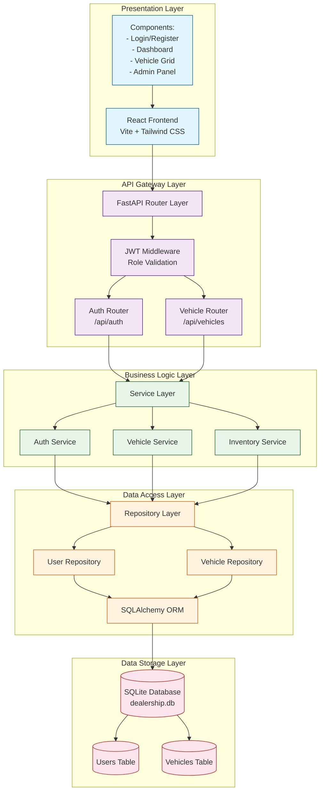

---

## 2. Data Flow Diagram (DFD) - Level 0

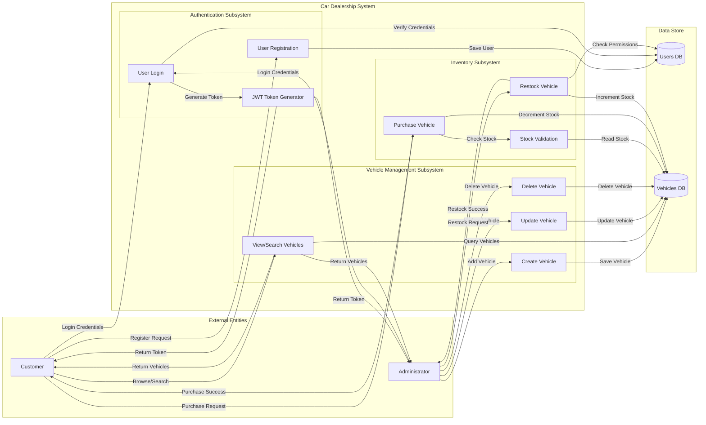

---

## 3. Data Flow Diagram (DFD) - Level 1 - Authentication Flow

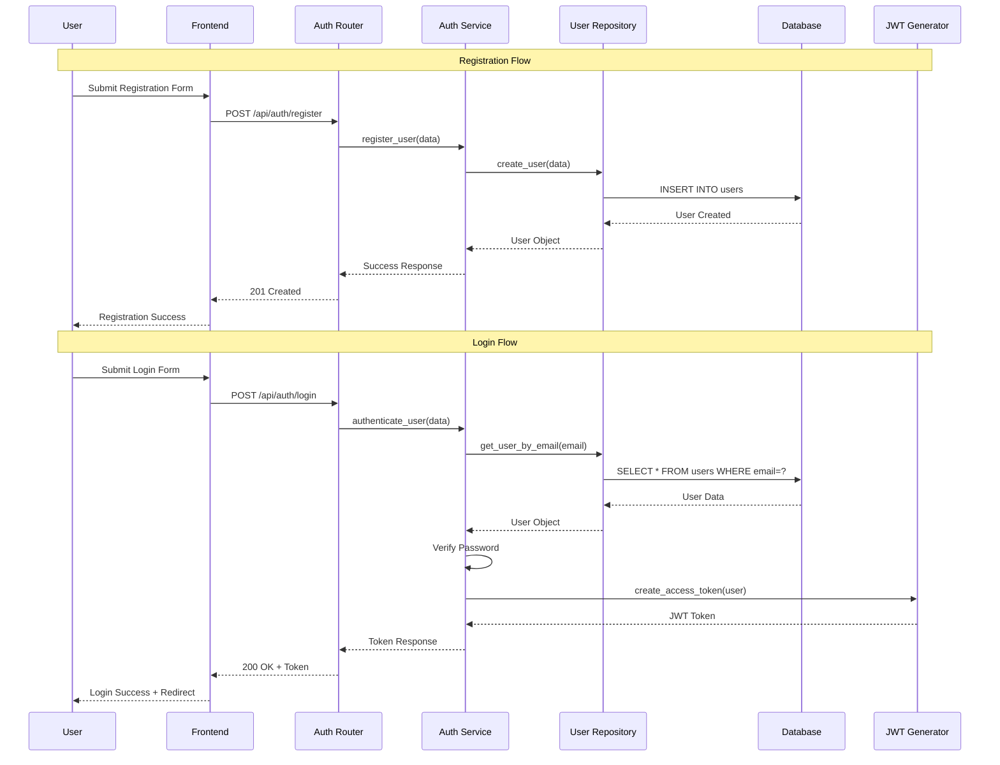

---

## 4. Component Architecture Diagram

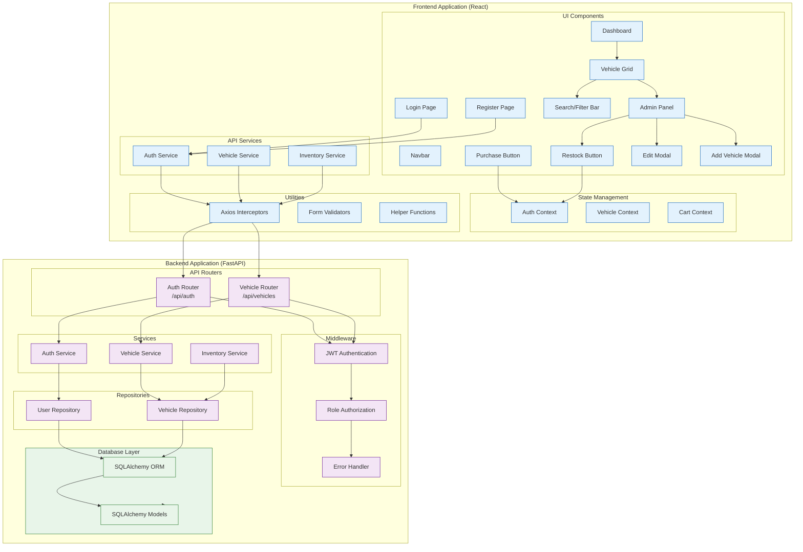

---

## 5. ER Diagram - Database Schema

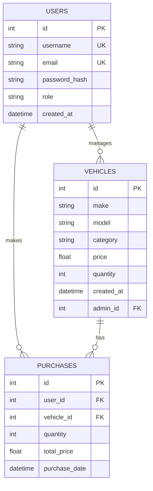

---

## 6. Sequence Diagram - Vehicle Purchase Flow

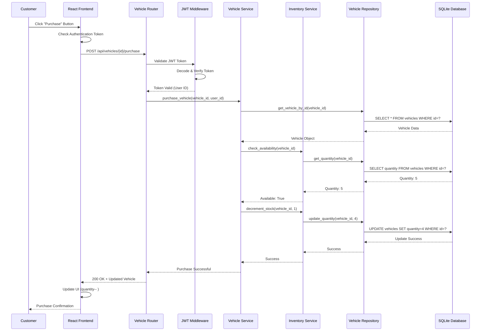

---

## 7. State Transition Diagram - Vehicle Lifecycle

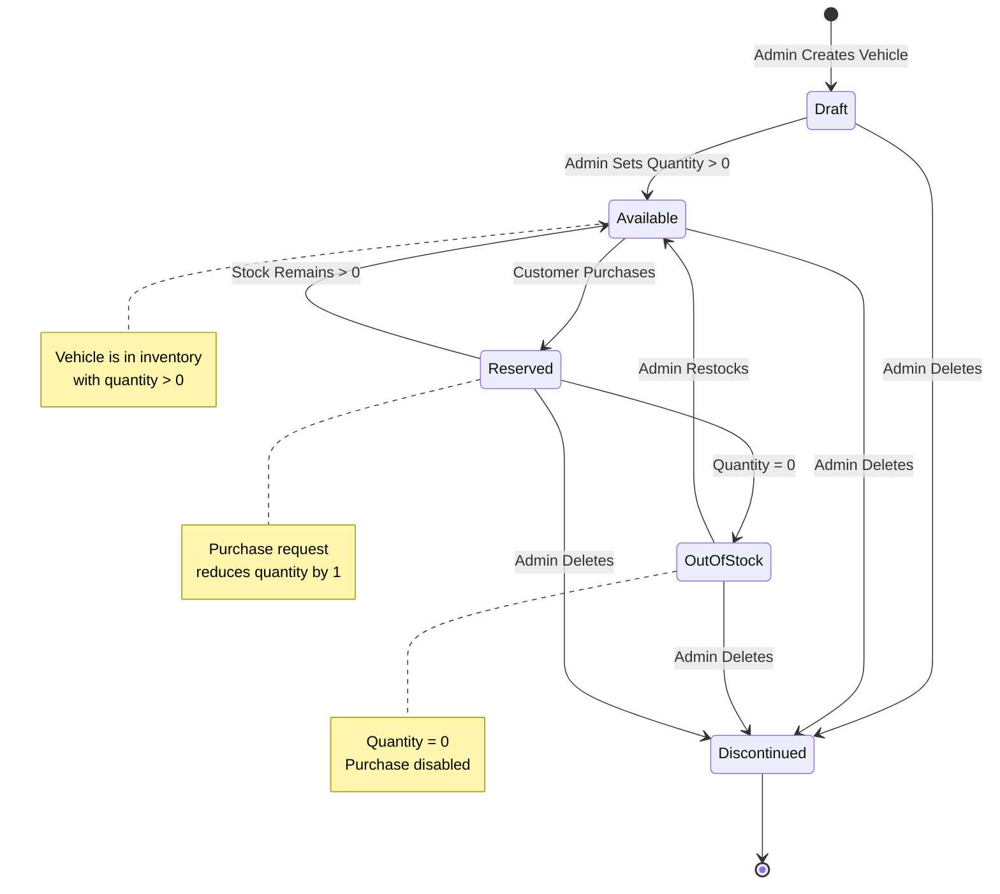

---

## 8. Security Architecture Diagram

```mermaid
flowchart TB
    subgraph Client["Client Side Security"]
        SecureStorage[Secure Storage<br/>LocalStorage/SessionStorage]
        HTTPS[HTTPS Encryption]
        InputValidation[Input Validation]
        CSP[Content Security Policy]
    end
    
    subgraph API["API Security Layer"]
        RateLimiting[Rate Limiting]
        CORS[CORS Configuration]
        SecurityHeaders[Security Headers]
    end
    
    subgraph Auth["Authentication Layer"]
        JWTValidation[JWT Validation]
        TokenExpiry[Token Expiry Check]
        RefreshToken[Refresh Token]
        SessionMgmt[Session Management]
    end
    
    subgraph Authorization["Authorization Layer"]
        RBAC[Role-Based Access Control]
        PermissionCheck[Permission Verification]
        AdminOnly[Admin-Only Endpoints]
    end
    
    subgraph Validation["Input Validation"]
        SchemaValidation[Pydantic Schema Validation]
        SQLInjection[SQL Injection Prevention]
        XSSProtection[XSS Protection]
        DataSanitization[Data Sanitization]
    end
    
    subgraph Data["Data Security"]
        PasswordHashing[Password Hashing<br/>bcrypt]
        EncryptedStorage[Encrypted Storage]
        TransactionSafety[Transaction Safety]
    end
    
    Client --> API
    API --> Auth
    Auth --> Authorization
    Authorization --> Validation
    Validation --> Data
    
    classDef client fill:#e3f2fd,stroke:#1565c0
    classDef api fill:#f3e5f5,stroke:#6a1b9a
    classDef auth fill:#e8f5e9,stroke:#2e7d32
    classDef authorization fill:#fff3e0,stroke:#e65100
    classDef validation fill:#fce4ec,stroke:#b71c1c
    classDef data fill:#f1f8e9,stroke:#33691e
    
    class SecureStorage,HTTPS,InputValidation,CSP client
    class RateLimiting,CORS,SecurityHeaders api
    class JWTValidation,TokenExpiry,RefreshToken,SessionMgmt auth
    class RBAC,PermissionCheck,AdminOnly authorization
    class SchemaValidation,SQLInjection,XSSProtection,DataSanitization validation
    class PasswordHashing,EncryptedStorage,TransactionSafety data
```

---

## 9. Deployment Architecture

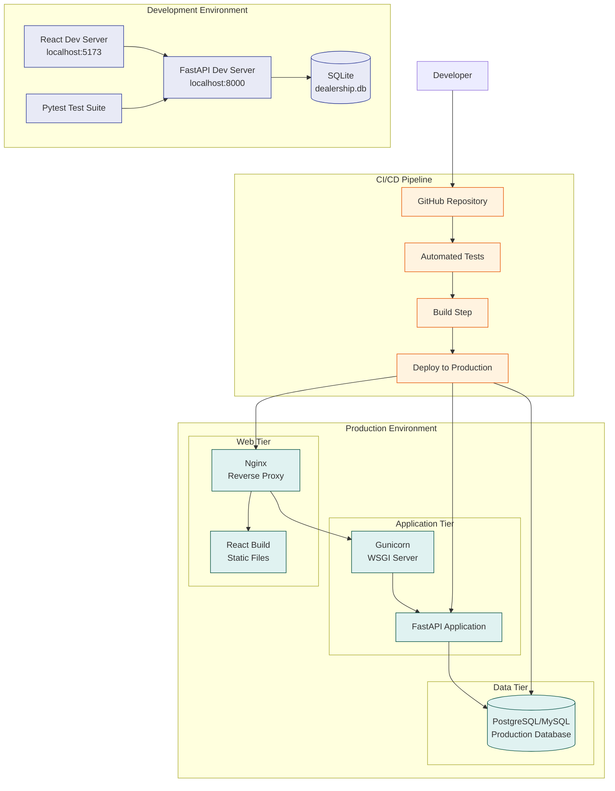

---

## 10. API Flow Diagram

```mermaid
flowchart LR
    subgraph Request["API Request Flow"]
        direction TB
        
        REQ[HTTP Request]
        VERB[HTTP Verb]
        PATH[URL Path]
        BODY[Request Body]
        HEADERS[Headers<br/>- Authorization<br/>- Content-Type]
    end
    
    subgraph Processing["Request Processing"]
        direction TB
        
        ROUTE[Route Handler]
        DEP[Parameter<br/>Dependency Injection]
        AUTH[JWT Validation]
        ROLE[Role Check]
        VALIDATE[Schema Validation]
        SERVICE[Service Call]
    end
    
    subgraph Response["API Response"]
        direction TB
        
        RES[HTTP Response]
        STATUS[Status Code]
        DATA[JSON Response]
        TOKEN[JWT Token<br/>(on login)]
        ERROR[Error Message]
    end
    
    REQ --> ROUTE
    VERB --> ROUTE
    PATH --> ROUTE
    BODY --> VALIDATE
    HEADERS --> AUTH
    
    ROUTE --> DEP
    DEP --> AUTH
    AUTH --> ROLE
    ROLE --> VALIDATE
    VALIDATE --> SERVICE
    
    SERVICE --> RES
    RES --> STATUS
    RES --> DATA
    RES --> TOKEN
    RES --> ERROR
    
    classDef req fill:#e3f2fd,stroke:#1565c0
    classDef proc fill:#f3e5f5,stroke:#6a1b9a
    classDef res fill:#e8f5e9,stroke:#2e7d32
    
    class REQ,VERB,PATH,BODY,HEADERS req
    class ROUTE,DEP,AUTH,ROLE,VALIDATE,SERVICE proc
    class RES,STATUS,DATA,TOKEN,ERROR res
```

---

## 11. Folder Structure Diagram

```mermaid
graph TB
    subgraph Project["Car Dealership Inventory System"]
        Root[📁 Project Root]
        
        subgraph Backend["📁 backend"]
            BEApp[📁 app]
            BEMain[📄 main.py]
            BEConfig[📄 config.py]
            BEDB[(📄 dealership.db)]
            BEPytest[📄 pytest.ini]
            BEReq[📄 requirements.txt]
            
            subgraph BEAppContent["📁 app content"]
                BEInit[📄 __init__.py]
                
                subgraph Auth[📁 auth]
                    AuthInit[📄 __init__.py]
                    JWT[📄 jwt.py]
                    Password[📄 password.py]
                end
                
                subgraph Database[📁 database]
                    DBInit[📄 __init__.py]
                    DBConn[📄 database.py]
                end
                
                subgraph Models[📁 models]
                    ModelInit[📄 __init__.py]
                    User[📄 user.py]
                    Vehicle[📄 vehicle.py]
                end
                
                subgraph Schemas[📁 schemas]
                    SchemaInit[📄 __init__.py]
                    UserSchema[📄 user.py]
                    VehicleSchema[📄 vehicle.py]
                end
                
                subgraph Repository[📁 repository]
                    RepoInit[📄 __init__.py]
                    UserRepo[📄 user_repo.py]
                    VehicleRepo[📄 vehicle_repo.py]
                end
                
                subgraph Services[📁 services]
                    ServInit[📄 __init__.py]
                    UserService[📄 user_service.py]
                    VehicleService[📄 vehicle_service.py]
                end
                
                subgraph Routers[📁 routers]
                    RouterInit[📄 __init__.py]
                    AuthRouter[📄 auth_router.py]
                    VehicleRouter[📄 vehicle_router.py]
                end
                
                subgraph Tests[📁 tests]
                    TestInit[📄 __init__.py]
                    Conftest[📄 conftest.py]
                    TestAuth[📄 test_auth.py]
                    TestVehicles[📄 test_vehicles.py]
                    TestInventory[📄 test_inventory.py]
                end
            end
        end
        
        subgraph Frontend["📁 frontend"]
            SRC[📁 src]
            
            subgraph SRCContent["📁 src content"]
                Components[📁 components]
                Pages[📁 pages]
                Context[📁 context]
                Services[📁 services]
                Utils[📁 utils]
                Styles[📁 styles]
                
                App[📄 App.jsx]
                Main[📄 main.jsx]
            end
            
            FEConfig[📄 vite.config.js]
            FEPackage[📄 package.json]
        end
        
        subgraph Docs["📁 docs"]
            README[📄 README.md]
            PRD[📄 PRD.md]
            IMPL[📄 implementation_plan.md]
            ARCH[📄 architecture.md]
            PROMPTS[📄 prompts.md]
        end
    end
    
    classDef root fill:#e8eaf6,stroke:#283593
    classDef backend fill:#e3f2fd,stroke:#1565c0
    classDef frontend fill:#f3e5f5,stroke:#6a1b9a
    classDef docs fill:#e8f5e9,stroke:#2e7d32
    
    class Root root
    class Backend,BEApp,BEAppContent,Auth,Database,Models,Schemas,Repository,Services,Routers,Tests,BEMain,BEConfig,BEDB,BEPytest,BEReq backend
    class Frontend,SRC,SRCContent,Components,Pages,Context,Services,Utils,Styles,App,Main,FEConfig,FEPackage frontend
    class Docs,README,PRD,IMPL,ARCH,PROMPTS docs
```

---

## 12. Component Interaction Diagram - Admin Operations

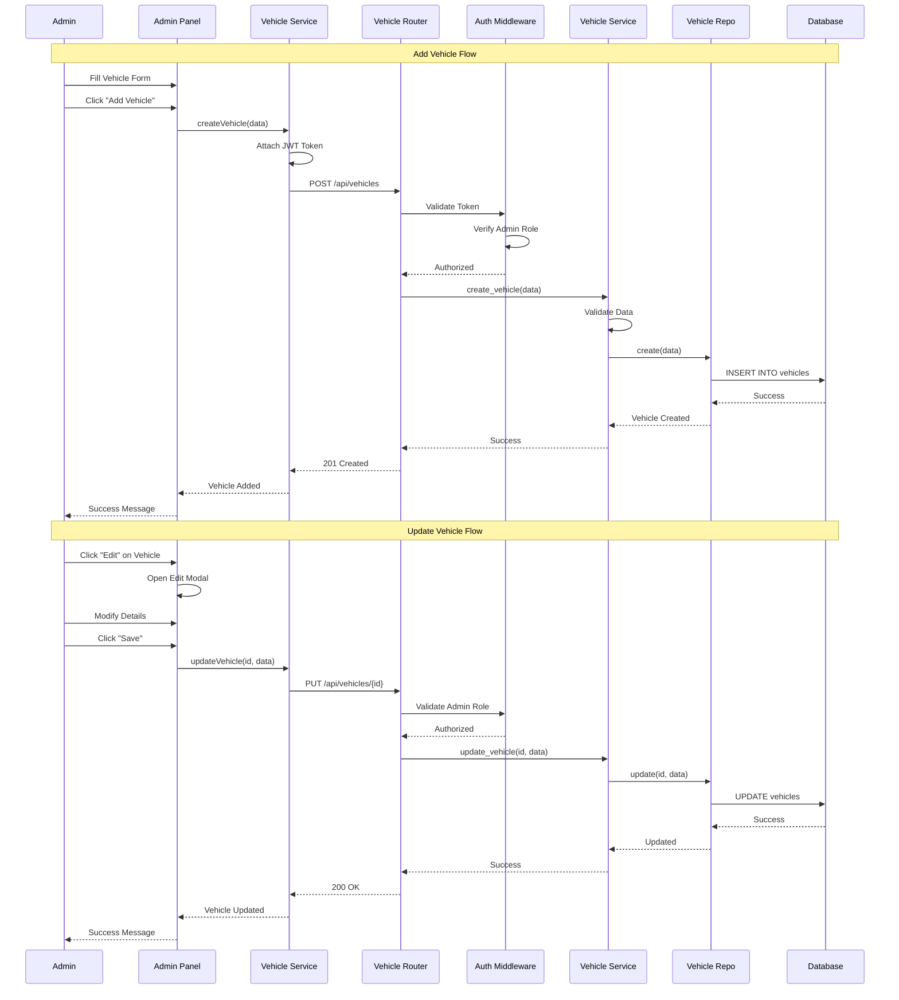

---

## 13. Error Handling Flow

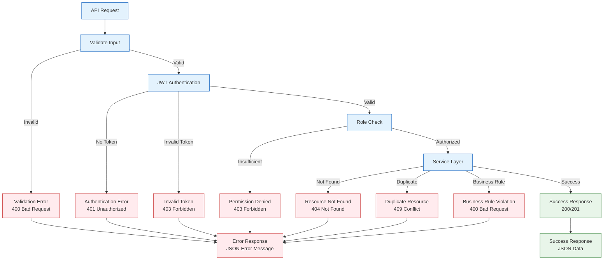

---

## 14. Technical Architecture Summary

### Architecture Patterns Used:
1. **Layered Architecture**: Presentation → Business Logic → Data Access → Database
2. **Repository Pattern**: Abstracts data access logic
3. **Service Layer Pattern**: Encapsulates business logic
4. **Dependency Injection**: Via FastAPI's dependency system
5. **JWT Authentication**: Stateless authentication
6. **RBAC**: Role-based access control

### Key Design Decisions:
- **SQLAlchemy ORM**: Database abstraction for future migrations
- **Pydantic Schemas**: Type validation and serialization
- **Async Support**: FastAPI's native async capabilities
- **Test-First Development**: All features TDD compliant
- **Component-Based UI**: Reusable React components

### Performance Considerations:
- Database indexing on frequently queried fields
- Connection pooling for database connections
- Efficient query optimization
- Client-side caching via React context
- Lazy loading for images and components

### Security Measures:
- JWT with expiration time
- bcrypt password hashing
- SQL injection prevention (ORM)
- XSS protection
- CORS configuration
- Rate limiting

### Scalability Considerations:
- Stateless API design enables horizontal scaling
- Database can be migrated to PostgreSQL/MySQL
- Frontend can be served via CDN
- API can be containerized with Docker
- Load balancer ready architecture

---

## 15. Technology Stack Summary

| Layer | Technology | Purpose |
|-------|-----------|---------|
| **Frontend** | React + Vite | UI Framework |
| | Tailwind CSS | Styling |
| | Axios | API Client |
| | React Router | Navigation |
| **Backend** | FastAPI | API Framework |
| | SQLAlchemy | ORM |
| | Pydantic | Data Validation |
| | JWT | Authentication |
| | Passlib | Password Hashing |
| **Database** | SQLite | Development |
| | PostgreSQL/MySQL | Production |
| **Testing** | Pytest | Backend Testing |
| | HTTPX | Async Testing |
| **Documentation** | Swagger/OpenAPI | API Documentation |

---

## 16. Communication Flow Summary

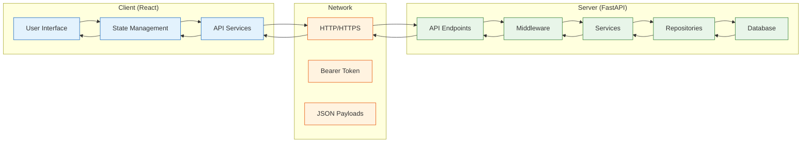

---

## 17. Data Validation Flow

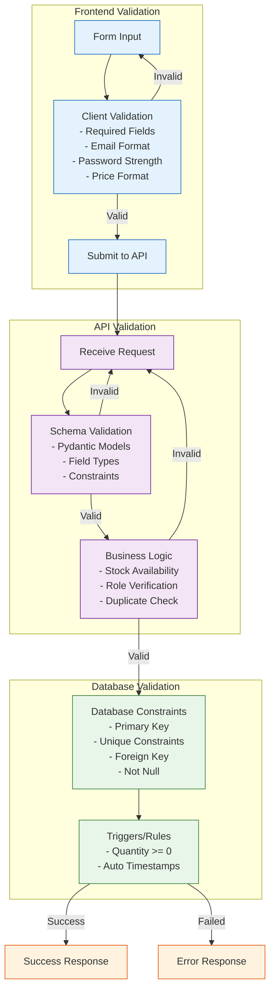

---

**Document Version:** 1.0  
**Last Updated:** 2026-07-19  
**Author:** Jannat Shaikh
```

This `architecture.md` file contains all the visual diagrams including:

1. **System Architecture Overview** - High-level architecture showing all layers
2. **Data Flow Diagram (DFD) Level 0** - External entities and system processes
3. **DFD Level 1 - Authentication Flow** - Detailed sequence for auth
4. **Component Architecture Diagram** - Frontend and backend component breakdown
5. **ER Diagram** - Database schema with relationships
6. **Sequence Diagram** - Vehicle purchase flow
7. **State Transition Diagram** - Vehicle lifecycle
8. **Security Architecture Diagram** - Security layers and measures
9. **Deployment Architecture** - Development and production environments
10. **API Flow Diagram** - Request processing lifecycle
11. **Folder Structure Diagram** - Complete project structure
12. **Component Interaction Diagram** - Admin operations flow
13. **Error Handling Flow** - Error processing pipeline
14. **Communication Flow Summary** - System communication
15. **Data Validation Flow** - Multi-layer validation

